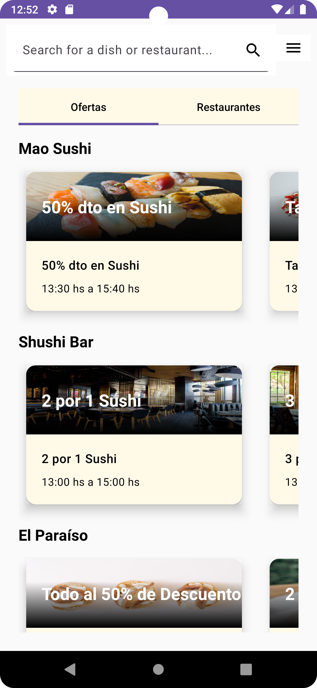
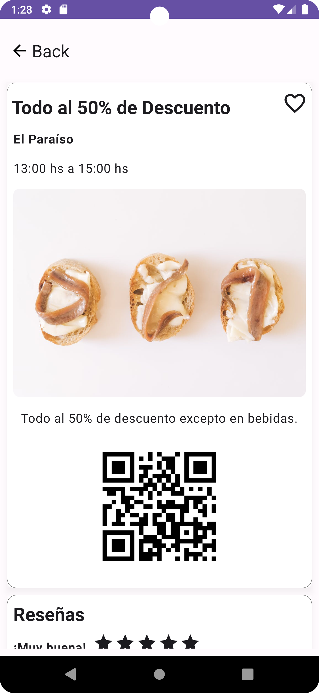
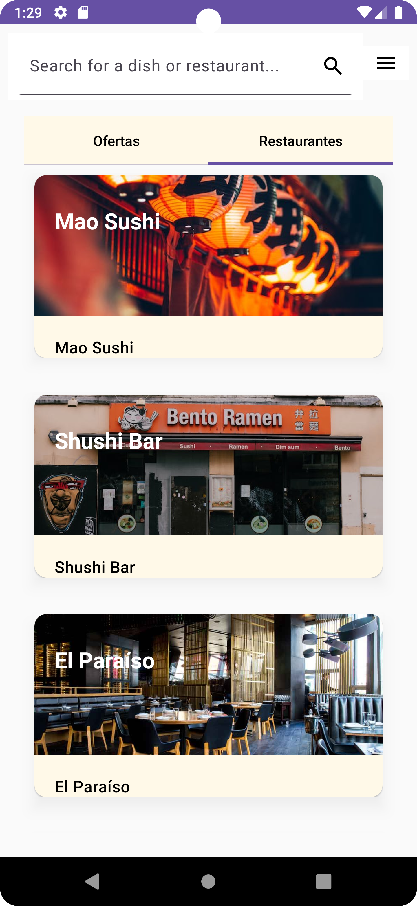
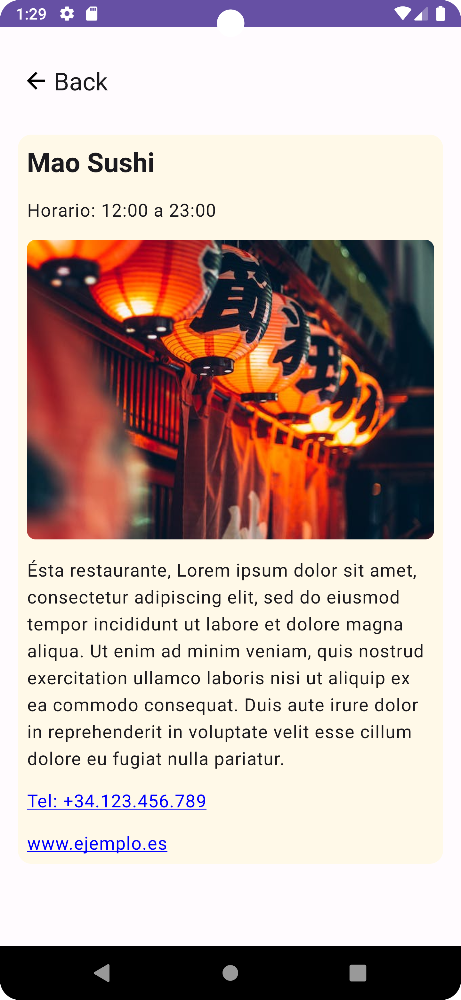

# Papeo Ya! Android Application (English)

## Introduction

An innovative bootcamp project using Jetpack Compose, Kotlin Flow, multiple API endpoint connections, Hilt, and SOLID/clean principles.

## Features

The application presents a main list with an offer and restaurant tab that fetches data using API data. The application will consist of:
* **Main Screen**. A list of active offers, displaying the offer title, photo, and validity times.
* **Offer Detail Screen**. A detailed offer view, displaying the offer title, image, hosting restaurant, hours of offer validity, a QR code for redemption, offer reviews (mocked), and further restaurant info.
* **Restaurant Tab Screen**. A list of active, participating restaurants near the user.
* **Restaurant Detail Screen**. A detailed restaurant view, displaying the restaurant name, picture, business hours, description, and contact information.

## Prerequisites:

* Android Studio Flamingo | 2022.2.1
* A device/emulator running Android API level 28 or higher.

Steps to Setup the Project:

1. Clone this repository.
2. Open the project in Android Studio.
3. Sync the Gradle files and wait for the build to complete.
4. To use this app, you will need to: Add an api key. Contact the development team to obtain one.
5. Clone and run the corresponding server repository at: https://github.com/Onetoucheasy/backend-vapor
6. Run this Android app on a device or an emulator.

## Usage

To use the app, as if a user, you would simply scroll vertically to the main list to view the restaurants and horizontally the respective offers. Click on a desired offer for more details.

Select the “restaurants“ tab to filter for participating restaurants. Simply scroll vertically and click a desired restaurant for more details.

---------------------------

# Papeo Ya! Android Aplicación (Español)
…
## Introducción

Un proyecto de bootcamp innovador que utiliza Jetpack Compose, Kotlin Flow, múltiples endpoints de API, Hilt y principios SOLID/clean.

## Características

La aplicación muestra una lista de ofertas y restaurantes (seleccionables vía tab) que recoge los datos a través de un API. La aplicación estará compuesta por:
* **Pantalla principal**. Una lista de ofertas activas, mostrando el título de la oferta y los horarios en los que es aplicable.
* **Pantalla de detalles de la oferta**. Una vista de detalle, en la que se puede acceder a los detalles y condiciones generales de la oferta, así como a la información del restaurante y las reseñas que tiene asociadas.
* **Pantalla de pestaña Restaurante**. Una lista de restaurantes participantes activos cerca del usuario.
* **Pantalla de detalles del restaurante**. Una vista detallada del restaurante, que muestra el nombre del restaurante, la imagen, el horario comercial, la descripción y la información de contacto.

## Prerrequisitos:

* Android Studio Flamingo | 2022.2.1
* Un dispositivo/emulador que ejecute Android API nivel 28 o superior.

Pasos para configurar el proyecto:

1. Clona este repositorio.
2. Abra el proyecto en Android Studio.
3. Sincronice los archivos de Gradle y espere a que se complete la compilación.
4. Para utilizar esta aplicación, necesitará: Agregar una clave API. Póngase en contacto con el equipo de desarrollo para obtener uno. Una vez que tenga una clave, vaya a "local.properties" dentro del navegador del proyecto y agregue el siguiente valor, API_KEY = "<PegaLaClaveAquí>".
5. Clona y ejecuta el repositorio del servidor correspondiente en: https://github.com/Onetoucheasy/backend-vapor
6. Ejecuta esta aplicación de Android en un dispositivo o emulador.

## Uso

Para utilizar la aplicación, como si fuera un usuario, simplemente tendría que desplazarse verticalmente a la lista principal para ver los restaurantes y horizontalmente las respectivas ofertas. Haga clic en la oferta deseada para obtener más detalles.

Seleccione la pestaña "restaurantes" para filtrar los restaurantes participantes. Simplemente desplácese verticalmente y haga clic en el restaurante que desee para obtener más detalles.

---------------------------

# Screenshots / Capturas de pantalla

| Título               | Imagen                              |
|----------------------|------------------------------------|
| App Main Screen      |  |
| Offer Detail Screen |  |
| Restaurant Tab Screen|  |
| Restaurant Detail Screen |  |

<!-- 
Main Screen

Offer Detail Screen

Restaurant Tab Screen

Restaurant Detail Screen

-->

